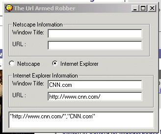



## Get displayed url from browser using DDE

### Description

This code retrieves the url and window title of any open instance of Netscape Navigator or Internet Explorer. It uses DDE (Dynamic data exchange) and WWW_GetWindowInfo and is much more reliable than the FindWindow Function. DDE is supported in Internet Explorer > 3.0 and in Netscape Navigator > 2.0.
 
### More Info
 
A very minor bug, in which the window title becomes the url with some server parsed pages.

             |
---                |---
**Submitted On**   |2000-03-26 14:55:38
**By**             |[Mark E\.](https://github.com/Planet-Source-Code/PSCIndex/blob/master/ByAuthor/mark-e.md)
**Level**          |Intermediate
**User Rating**    |4.5 (72 globes from 16 users)
**Compatibility**  |VB 4\.0 \(32\-bit\), VB 5\.0, VB 6\.0
**Category**       |[DDE](https://github.com/Planet-Source-Code/PSCIndex/blob/master/ByCategory/dde__1-28.md)
**World**          |[Visual Basic](https://github.com/Planet-Source-Code/PSCIndex/blob/master/ByWorld/visual-basic.md)
**Archive File**   |[CODE\_UPLOAD43063262000\.zip](https://github.com/Planet-Source-Code/mark-e-get-displayed-url-from-browser-using-dde__1-6808/archive/master.zip)

